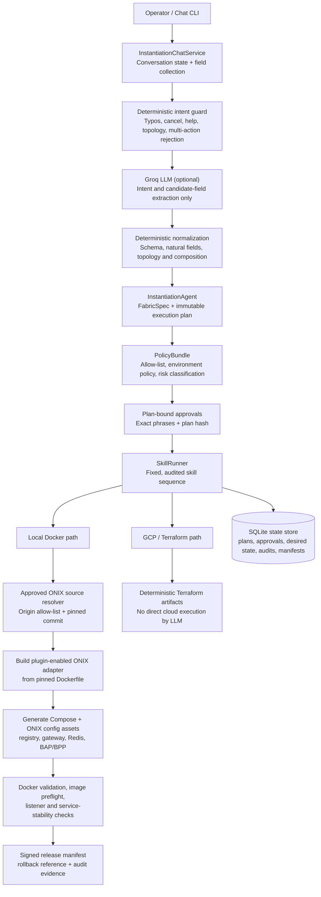
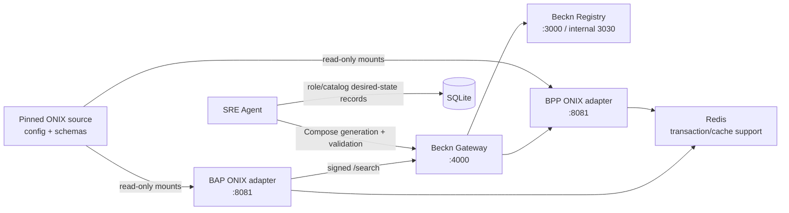
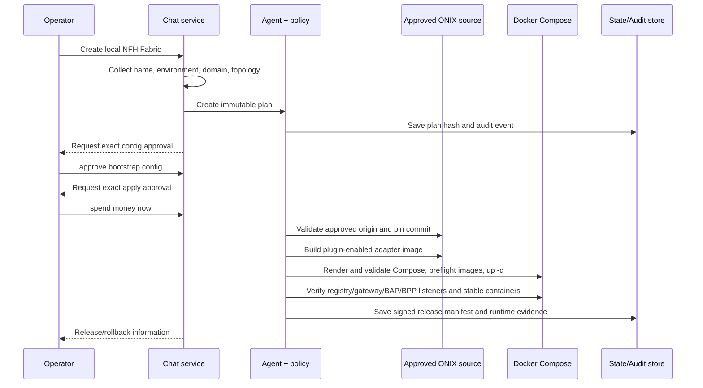
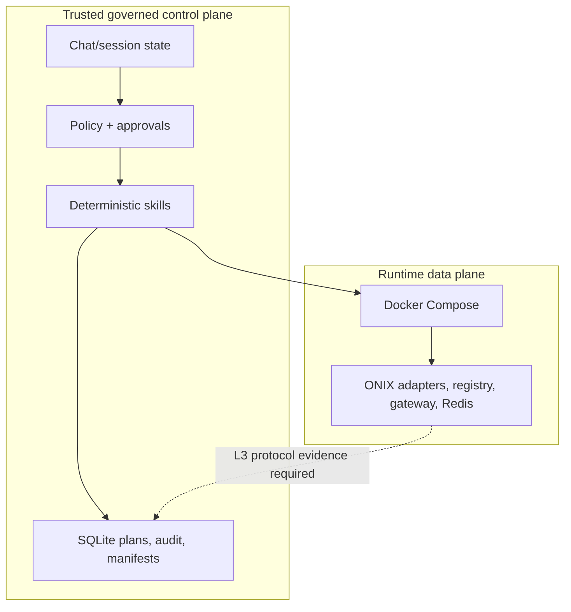

# Governed NFH Fabric SRE Agent — Architecture

This agent turns an operator's natural-language request into a governed, deterministic NFH/Beckn Fabric workflow. It supports local Docker Fabric execution and retains the GCP/Terraform path. The LLM assists only with intent/field extraction and wording; it never chooses a skill chain, bypasses policy, or executes infrastructure commands.

## System Overview

```text
                     ┌─────────────────────────────┐
                     │       Operator / Chat CLI    │
                     └──────────────┬──────────────┘
                                    │ natural language
                     ┌──────────────▼──────────────┐
                     │ InstantiationChatService     │
                     │ session, fields, cancel/why  │
                     └──────────────┬──────────────┘
                                    │
          ┌─────────────────────────▼─────────────────────────┐
          │ Deterministic guard                                │
          │ typo normalization • multi-action rejection        │
          │ topology selection • supported-intent enforcement  │
          └──────────────┬───────────────────────┬─────────────┘
                         │                       │
              optional candidate fields          │ deterministic routing
                         │                       │
                 ┌───────▼───────┐       ┌───────▼─────────────────┐
                 │ Groq LLM      │       │ InstantiationAgent       │
                 │ parse only    │       │ FabricSpec + plan hash   │
                 └───────────────┘       └───────┬─────────────────┘
                                                 │
                   ┌─────────────────────────────▼──────────────────────────┐
                   │ Policy + exact plan-bound approvals + fixed SkillRunner │
                   └──────────────┬───────────────────────────────┬─────────┘
                                  │ local                          │ GCP
                    ┌─────────────▼──────────────┐   ┌─────────────▼─────────┐
                    │ approved ONIX source        │   │ Terraform artifacts    │
                    │ pin commit → build adapter  │   │ cost/policy governance │
                    │ Compose → verify → release  │   └───────────────────────┘
                    └─────────────┬──────────────┘
                                  │
                    ┌─────────────▼──────────────┐
                    │ SQLite state / audit store  │
                    │ plans • approvals • releases│
                    └─────────────────────────────┘
```



## Local Fabric Runtime

```text
                      generated, pinned ONIX config/assets
                                    │ read-only mount
                                    ▼
 ┌─────────────────┐ signed /search  ┌──────────────┐ lookup/route ┌─────────────────┐
 │ BAP adapter     ├─────────────────►│ Beckn Gateway├──────────────►│ BPP adapter     │
 │ localhost:port  │                  │ :4000        │               │ localhost:port  │
 └───────┬─────────┘                  └──────┬───────┘               └───────┬─────────┘
         │                                    │                               │
         │ cache/transaction                   │ subscribers/keys              │ cache/transaction
         ▼                                    ▼                               ▼
 ┌───────────────┐                      ┌───────────────┐             ┌───────────────┐
 │ Redis         │                      │ Beckn Registry│             │ Redis         │
 │ internal:6379 │                      │ :3000/:3030   │             │ internal:6379 │
 └───────────────┘                      └───────────────┘             └───────────────┘

 Agent control plane: source pin → build → Compose validation → Docker up → L1/L2 verification
```



The agent deterministically assigns localhost ports and uses a Compose project name scoped to the Fabric (`nfh-<fabric-name>`), so multiple Fabrics do not accidentally share services.

## Governed Bootstrap Flow



## Guardrails and Governance

| Guardrail | How it works | Why it matters |
|---|---|---|
| LLM containment | Groq returns candidate intent/fields only. Deterministic code selects supported intents and fixed skill chains. | A model cannot issue shell/Docker/Terraform actions. |
| Exact approvals | Mutating operations require exact approval phrases. Bootstrap uses `approve bootstrap config` then `spend money now`. | Prevents vague confirmations from creating infrastructure. |
| Plan binding | Approval is recorded against an immutable plan ID and plan hash. A desired-state change invalidates old approval. | Prevents approval reuse after a changed plan. |
| Policy enforcement | Every skill is checked against the policy bundle, actor, environment, and risk level. | Gives one enforcement point for dev/prod differences. |
| Source provenance | ONIX source origin must be allow-listed; a commit is resolved and pinned before adapter build. | Prevents unapproved source/image substitution. |
| Image preflight | Generated Compose images must exist locally before `docker compose up`. | Avoids fake or unavailable image references at runtime. |
| Compose validation | `docker compose config --quiet` runs before execution. | Blocks malformed generated Compose safely. |
| Runtime truthfulness | Release is withheld unless required listeners and expected services are healthy/stable. | A running registry alone cannot be reported as a successful Fabric. |
| Participant isolation | Roles are stored and rendered under `role:<fabric>:<subscriber>:<role>`. | Prevents another Fabric's BAP/BPP leaking into this Fabric. |
| Identity validation | Subscriber IDs must be DNS-like and cannot contain URLs, callbacks, or secret-like content. | Prevents configuration/secret injection through identity fields. |
| Secret handling | Inputs carry secret references, not secret values; secrets are not persisted as runtime configuration by the chat layer. | Reduces secret exposure in state and logs. |
| Audit and releases | Each skill records a signed audit event; successful local releases create signed manifests and rollback references. | Supports investigation and controlled rollback. |
| Safe conversational controls | `cancel`/`cancle` clears pending work, `show plan`, `show diff`, `why`, and discovery commands are read-only. Unsupported `run` is not executed. | Makes chat operation reversible and understandable. |

## Fixed Skill Chains

Skill chains are code-defined—not model-defined.

| Operation | Ordered skills |
|---|---|
| Local bootstrap | intent diff → credential handling → source resolution → runtime build → image preflight → bootstrap approval → Compose execution → health/stability verification → release manifest |
| Local participant join | DID provisioning → capability credential → role registration → Compose reconciliation → adapter health/stability verification |
| Catalog publish | policy/approval gate → catalog publish client → audit record |
| GCP bootstrap | intent diff → cost estimate → credential handling → bootstrap artifact generation → release manifest |

## Evidence Levels

The agent deliberately distinguishes levels of evidence:

- `L1_RUNTIME`: expected Compose services are present and stably running.
- `L2_SERVICE`: required host listeners are reachable by TCP.
- `L3_PROTOCOL`: a real Beckn request has been signed, routed, accepted, and correlated with a BPP response.

The current local bootstrap release gate requires L1 and L2. A real BAP `/search` test was executed against the generated ONIX stack and exposed the remaining L3 gap: runtime registry subscriber/key registration and per-participant adapter signing identity are not yet reconciled with the agent's desired-state registration records. Therefore the agent must report a NACK/blocked semantic verification rather than claim a successful end-to-end transaction.

## Current Trust Boundary



The next reliability milestone is to make role registration an authenticated registry operation, generate per-participant ONIX signer configuration from approved key material/references, and require a correlated BAP → gateway → BPP → `on_search` verification before marking a transaction as successful.
